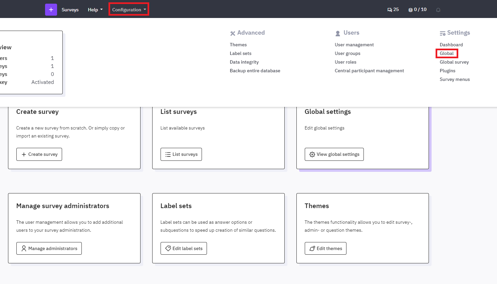
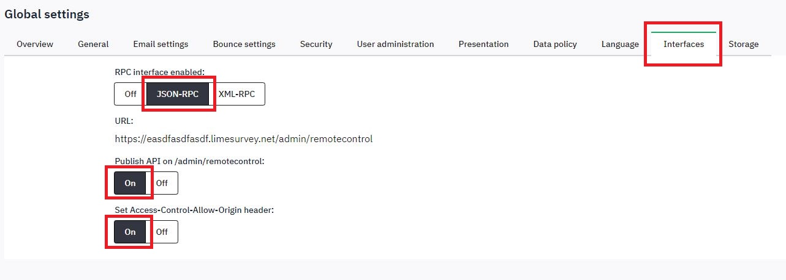
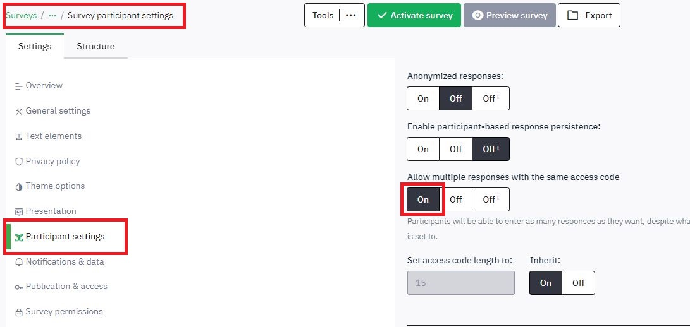
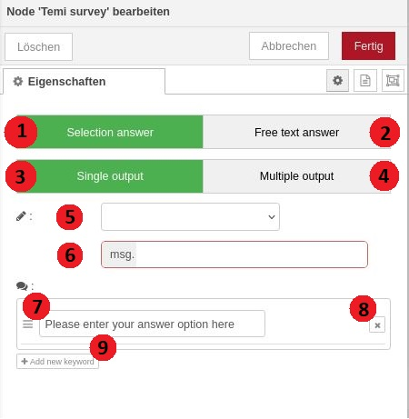
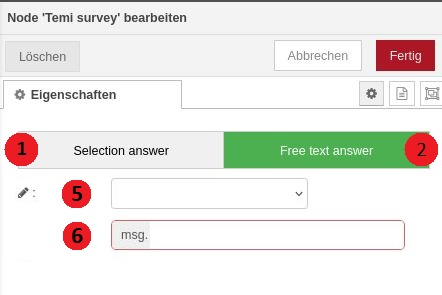

# LimeSurveys with Temi

## THIS FEATURE IS CURRENTLY NOT TESTED!

---

**Please note** that the Temi app must be configured to integrate this node and the topics used by the node. Without these configurations, the node cannot be utilized effectively.

#### Setting Up LimeSurvey

**LIME SURVEY IS CURRENTLY WIP**

To successfully connect the Temi Survey Node with LimeSurvey and conduct surveys, a basic configuration of LimeSurvey is required. The following steps outline the necessary setup:
1.	Create a LimeSurvey Account:
If you don’t already have a LimeSurvey account, create one at https://account.limesurvey.org/de/jetzt-registrieren.
2.	Generate a LimeSurvey Site:
    1. Create a new LimeSurvey site at https://account.limesurvey.org/start/create-site.
    2. The created site can be viewed under *View survey site* at https://account.limesurvey.org/account/your-account.
3.	Create a New Survey:
    1. Click on *+ Create Survey*, enter a name for the survey, and confirm the creation by clicking *Create*.
4.	Add Questions to the Survey:
    1. Select *+ Add Question* to add new questions to the survey.
    2. **Question Type**: Currently, only free text questions are supported.
    3.	Save the question at the top with *Save*. The order of the questions can be changed by dragging and dropping them.
5.	Interface Configuration (important for communication between Node RED and LimeSurvey):
    1.	Go to **Configuration\Global Settings\Interfaces**.
    2.	Enable the **JSON-RPC** 
    3.	Set **Publish API on /admin/remotecontrol** and **Set Access-Control-Allow-Origin header** to *On*.
    

      
      
    

6.	Survey Participant Settings:
    1.	In the *Surveys* tab, select the survey you wish to use.
    2. Go to **Settings\Participant** Settings and enable the option **Allow multiple answers with the same access code**.
    

      
    

7.	Activate the Survey:
Activate the survey to make it available for use with the Temi Survey Node.

After completing these steps, LimeSurvey is fully set up for communication with the Temi Survey Node.

#### Temi Survey Node

1. **Modifications** in Temi *Survey.js*
    1. **brokerConfig**: Ensure that the correct broker configuration data is entered in lines 7–11.

    2. **apiConfig**: enter your LimeSurvey account details and survey information in lines 54-61. The *path* is standardized and does not need to be changed.
    *The survey ID can be found under Survey within the survey list table.*

2. Temi Survey Node **Configuration** in *Node-RED*
    

      
      

    

    
    1. Selecting this button allows the question specified in Point 5 to be answered only with the response options entered in Point 7. If the user provides an alternative response, the question will be repeated by the system until the user provides one of the response options specified in Point 7. 
    
    2. Selecting this button allows the question specified in Point 5 to be answered with any response from the user. 
    
    3. This button is available only if the button in Point 1 is selected. Choosing this button ensures that, upon a correct response to the question from Point 5, the node will always exit through the same output. 

    4. This button is available only if the button in Point 1 is selected. Choosing this button ensures that, upon a correct response to the question from Point 5, the node will exit through a different output depending on which response from the list in Point 7 was given. The node outputs are arranged in the same order as the responses in the list from Point 7.

    5. The dropdown list allows for selecting the question that Temi should ask the user. This list is automatically populated via the API with the questions contained in LimeSurvey. Once a question is selected, Temi presents it to the user both verbally and on the display.

    6. This field is automatically populated after selecting a question in the dropdown list from Point 5. No additional setting is required. 
    
    7. This field is available only if the button in Point 1 is selected. Here, the response options are entered, which the user is allowed to use to answer the question from Point 5. 

    8. This button is available only if the button in Point 1 is selected. By clicking this button, an additional field can be added for another response option to the list in Point 7. If the button from Point 4 is selected, an additional output will automatically be added to the node.